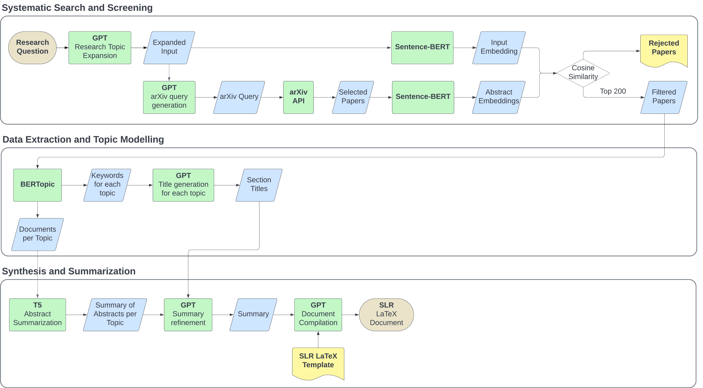

# PROMPTHEUS: A Human-Centered Pipeline to Streamline SLRs with LLMs

This AI-driven tool is designed to automate the systematic literature review (SLR) process. It uses OpenAI's GPT models, topic modeling, and other natural language processing techniques to refine and enhance machine-generated summaries from academic papers.



## Features

- **Title Expansion**: Automatically expands literature review titles using GPT models.
- **Arxiv Query**: Fetches academic papers from Arxiv based on the expanded title.
- **Topic Modeling**: Performs topic modeling on the retrieved papers.
- **Summarization**: Refines and enhances machine-generated summaries using GPT models.
- **LaTeX Document Generation**: Creates a LaTeX-formatted document for the final output.
- **Metrics**: Computes ROUGE scores, readability scores, and similarity metrics between documents and input.
- **LaTeX Document Generation**: Automatically generates a LaTeX-formatted document for the final output of the systematic literature review.

## Requirements

Ensure you have the following installed:

- **python3 3.7+**
- **pip**
- **OpenAI API Key** (in a `.env` file)

## Installation

1. **Clone the repository**:

   ```bash
   git clone https://github.com/joaopftorres/AI-SLR.git
   ```

2. **Create a .env file**:
- In the root of your project, create a .env file and add your OpenAI API key:
```
OPENAI_API_KEY=your-openai-api-key-here
```

3. **Run the setup script to install the necessary dependencies and download required resources**:
```
./setup.sh
```
The setup.sh script will:
- Install python3 packages listed in requirements.txt.
- Download the NLTK stopwords and tokenizer data (stopwords, punkt, punkt_tab).
- Download the spaCy en_core_web_sm language model.

## Usage
After installation, you can run the tool via the command line to refine literature reviews.
The output will be saved as a LaTeX-formatted document, which you can further refine or directly compile into a PDF for the final report.

1. **Basic Usage**:
To refine a literature review for a specific title, run:
```
python3 main.py "Title of the Literature Review"
```


2. **Optional Arguments**:
You can also specify the GPT model and the maximum number of papers to process:
```
python3 main.py "Title of the Literature Review" --gpt_model "gpt-4o" --max_papers 100
```

- --gpt_model: The GPT model to use for refinement (default: gpt-3.5-turbo).
- --max_papers: Maximum number of papers to process (default: 200).

3. **Help Command**:
For additional usage information, you can use the --help flag:
```
python3 main.py --help
```

4. **Example**:
```
python3 main.py "AI in Healthcare" --gpt_model "gpt-4o" --max_papers 50
```
This example refines a literature review on the topic "AI in Healthcare" using GPT-4o and processes up to 50 papers.

## Project Structure
- main.py: Entry point of the tool.
- setup.sh: Installation script for setting up the environment and downloading required resources.
- requirements.txt: List of required python3 packages.
- query_arxiv.py: Module for querying Arxiv.
- cleaner.py: Module for cleaning and processing text data.
- topic_model.py: Module for performing topic modeling on the retrieved papers.
- summarizer_pipeline.py: Module for summarizing and refining text using GPT models.
- file_saver.py: Module to save files.
- metrics.py: Module for calculating ROUGE, readability, and similarity metrics.

